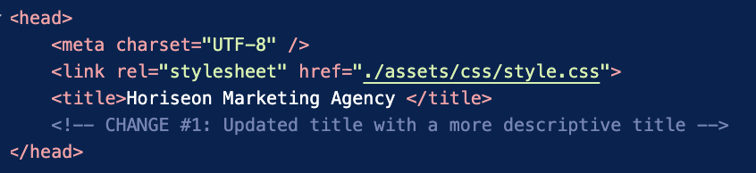
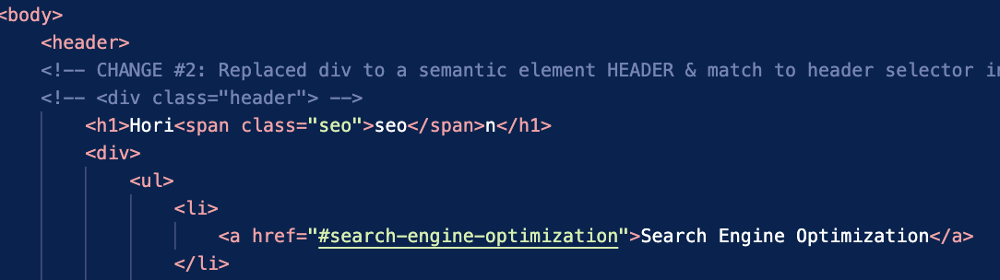
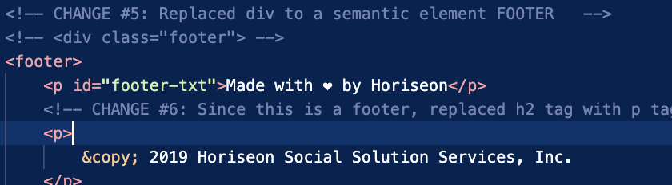

# HORISEON MARKETING AGENCY
 <h2><a href="https://kfmatovic716.github.io/HORISEON-module1-challenge/">Visit Us</a><h2>

| Technology Used         | Resource URL           | 
| ------------- |:-------------:| 
| HTML    | [https://developer.mozilla.org/en-US/docs/Web/HTML](https://developer.mozilla.org/en-US/docs/Web/HTML) | 
| CSS     | [https://developer.mozilla.org/en-US/docs/Web/CSS](https://developer.mozilla.org/en-US/docs/Web/CSS)      |   
| Git | [https://git-scm.com/](https://git-scm.com/)     |    

## Description

Horiseon Marketing Agency aims to improve its codebase to conform with accessibility standards to optimize their website for search engines. We are hired to refactor their existing site for this purpose of enhancing accessibility. 

## ACCEPTANCE CRITERIAS given a webpage meets accessibility standards
* When the source code is viewed, should find semantic html elements
* When structure of HTML elements are viewed, should find that the elements follow a logical structure independent of styling and positioning
* When image elements are viewed, should find accessible alt attributes
* When heading elements are viewed, they should fall on sequential order
* When title elements are viewed, should find a concise, descriptive title

## Steps in Code Refactoring

1. Updated the title with a more concise and descriptive title from "webpage" to "Horiseon Marketing Agency"

2. Semantic HTML elements described content of the webpage and are utilized to improve accessibility of a webpage. Conversions of non-semantic elements to semantic elements in the HTML file were done in the following areas:

    a. div class header replaced by HEADER: This change required modifications in the stylesheet - removed selectors with class header and retain one header selector only; in class header h1 selector, remove class header and retain h1 selector since h1 is only used in one place; in class header h1 seo remove class header and h1, retain class seo becauses only referenced in one place

    

    b. div class="search-engine-optimization", div class="online-reputation-management", div class="social-media-marketing" replaced by SECTION: This change required modifications in the stylesheet - all selectors that are referenced by these classes were consolidated into one selector which is the section selector since the property and values are all the same; this also applies to the images, consolidated into one selector called section img

    

    c. div class="footer" replaced by FOOTER: This change required modifications in the stylesheet - replaced selector from class footer to footer; also changed h2 tag to a paragraph tag (normally used in footer tag) because header tags doesnt seem to be appropriate to use in footer element. To preserve the font style, added id of footer-txt.

     

3. Added alt attributes to the image element 

4. Omitted the header div ul selector because there are no specific type of marker for the lists and really not used anywhere else

5. Simplified the header div ul li selector to just an li selector. There is only only one place for list tags.

6. Consolidated the following classes: benefit-lead, benefit-brand, benefit-cost into one selector called benefit-desc class since all have the same property-value.

7. Consolidated the following classes: benefit-lead h3, benefit-brand h3, benefit-cost h3 into one selector h3 because all have the same property-value.

8. Added class icon in HTML file inside div class=benefits to consolidate the images into one selector class icon. All property-values of the original selectors are the same.

9. Cosolidated all h2 tags from secetion element to one slector h2 since property-values are the same.

## Learning Outcomes

Code refactoring is one of the most important skill of a web developer because of the following:
* Help build growth mindset, due to the patience and focus that a developer needs to endure while understanding the meaning of each line of code
* Recognize patterns of behavior between the elements, styling and positioning
* Learn to simplify by consolidating redundant codes and improve readability
* Learn to find better approach to a problem

 

## Author Info
### Katherine Matovic
* [LinkedIn](https://www.linkedin.com/in/katherine-matovic-911666200/)
* [Github](https://github.com/kfmatovic716)

